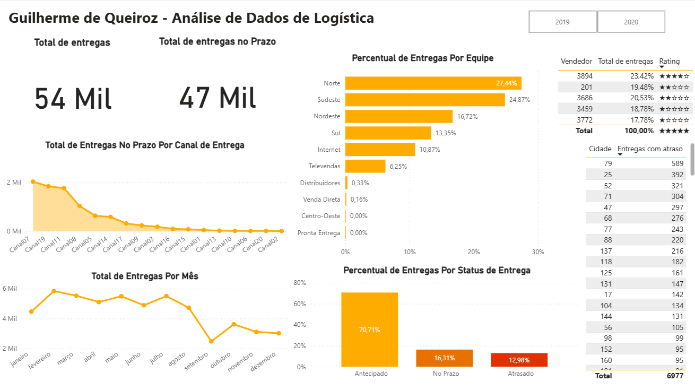

# 🚚 Análise de Dados de Logística com Power BI

Este projeto propõe uma abordagem prática e analítica para a exploração de dados logísticos fornecidos pela Data Science Academy, utilizando o Power BI como ferramenta principal para modelagem, visualização e extração de insights estratégicos.

---

## 🎯 Objetivo

Entregar aos tomadores de decisão uma visão clara e estratégica sobre:

- Eficiência nas entregas por canal e equipe  
- Volume de entregas ao longo do tempo  
- Desempenho dos principais vendedores  
- Atrasos por cidade  
- Distribuição dos status de entrega

---

## 🧠 O que foi desenvolvido

- ✅ Dashboard construido com base em KPIs reais  
- ✅ Medidas DAX personalizadas  
- ✅ Correções de erros e inconsistências nos dados  
- ✅ Customizações e formatações avançadas

---

## 🗂️ Visões do Projeto

### 1. **Entregas no Prazo por Canal**
- Análise do volume de entregas realizadas dentro do prazo, segmentadas por canal (e-commerce, loja física, franquia, etc.)

### 2. **Entregas Antecipadas por Equipe**
- Percentual de entregas feitas antes do prazo por cada equipe de entrega

### 3. **Volume Mensal de Entregas**
- Evolução do número de entregas ao longo dos meses

### 4. **Top 5 Vendedores**
- Total de entregas realizadas por produtos dos cinco vendedores com maior volume

### 5. **Atrasos por Cidade**
- Identificação das cidades com maior número de entregas atrasadas

### 6. **Status de Entrega**
- Distribuição percentual entre entregas concluídas, atrasadas e não realizadas

---

## 📷 Dashboard

---

## 📁 Arquivos do Repositório

- `Dashboard/` — Arquivo principal do projeto no Power BI
- `Data/` — Dados do projeto
- `README.md` — Documentação
- `imagens/` — Imagem do dashboard

---

## 📌 Requisitos

Para visualizar o projeto completo, é necessário ter o **Power BI Desktop** instalado.

---

## 📬 Contato

Projeto desenvolvido por **Guilherme de Queiroz**  
📧 dequeirozguilherme1899@gmail.com  
🔗 [Portfólio no GitHub](https://github.com/dequeirozguilherme1989-tech)

---

> Este projeto é parte do conteúdo prático da Data Science Academy e tem como objetivo aplicar conceitos de análise de dados em um cenário logístico, reconstruindo visualizações com base em KPIs reais e boas práticas de Business Intelligence.
